# AMOA TradingView Overlay

Chrome extension that overlays [A Mountain Of Alpha](https://www.amountainofalpha.com) option-flow metrics directly onto your TradingView charts — peak-strike dots on the price axis, delta / gamma / notional lines on a left-axis study.

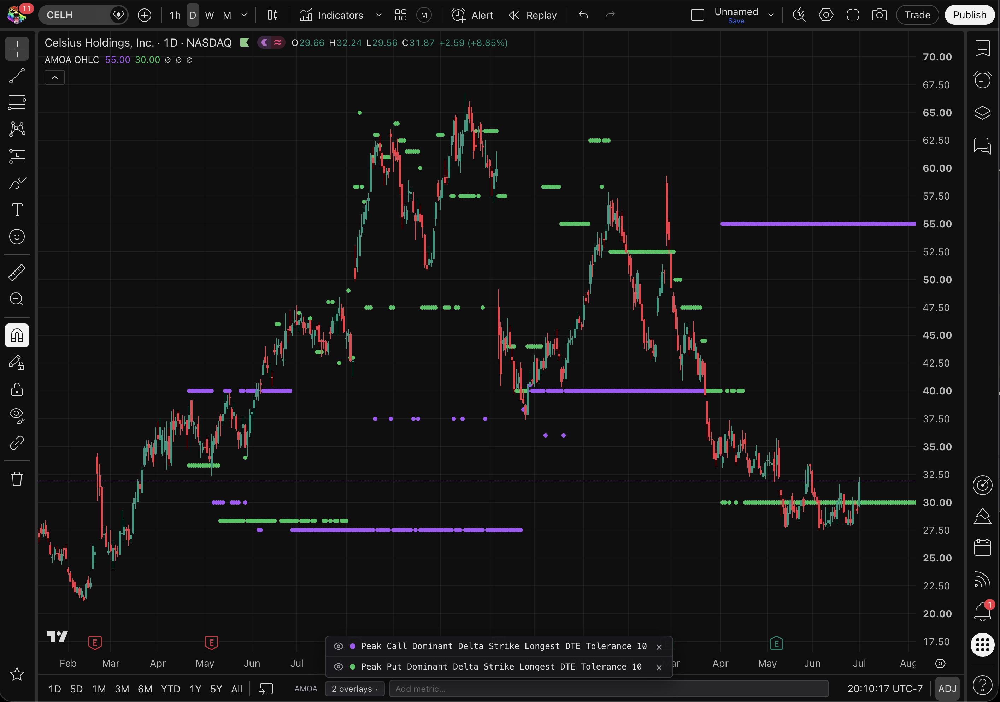

---

## Install

1. Download the latest `amoa-tv-v<version>.zip` from [Releases](https://github.com/amountainofalpha/amoa-tv/releases) and unzip it.
2. Open `chrome://extensions` and enable **Developer mode** (top-right).
3. Click **Load unpacked** and select the unzipped folder.
4. Pin the extension so the popup is one click away.

---

## Sign in

Click the extension icon in your toolbar. The popup opens with the sign-in state:

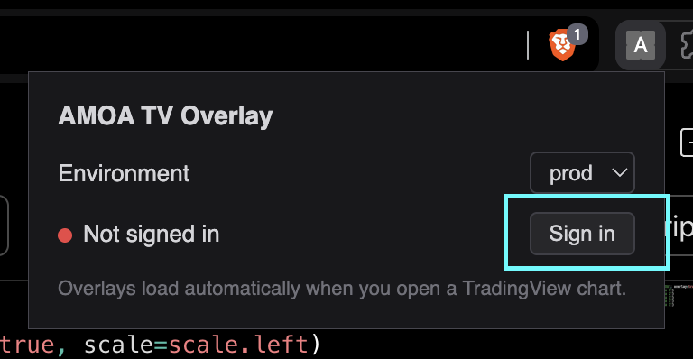

Click **Sign in**. A new tab opens for the AMOA OAuth flow — click **Authorize** to grant the extension access.

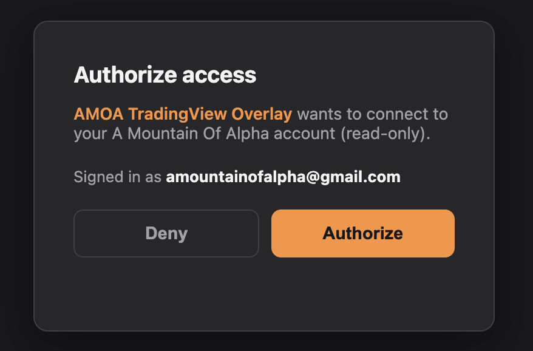

After you authorize, the popup shows a green ● **Signed in** and the **Setup** section appears — you now have two Pine scripts to add.

---

## Setup — two Pine scripts

The extension renders non-price metrics (percent, ratio, days, notional dollars) via two Pine indicators that live on your chart. You add them **once**; the extension auto-detects their IDs the moment they're on any chart and remembers them forever.

Open any chart at [tradingview.com/chart](https://www.tradingview.com/chart/) and click the **Pine Editor** tab at the bottom of the screen.

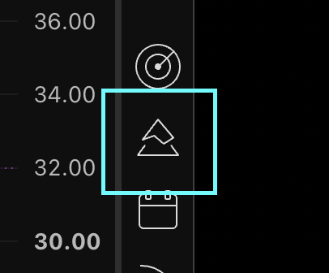

### 1. Create a new indicator

In the Pine Editor's toolbar, click the ⋯ menu → **New** → **Blank indicator script**.

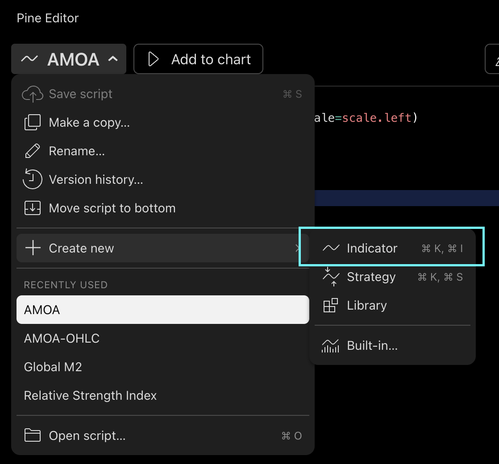

### 2. Paste the AMOA script

Replace the editor's contents with:

```pine
//@version=6
indicator('AMOA', overlay=true, scale=scale.left)
plot(na, 'data 1')
plot(na, 'data 2')
plot(na, 'data 3')
plot(na, 'data 3')
plot(na, 'data 3')
```

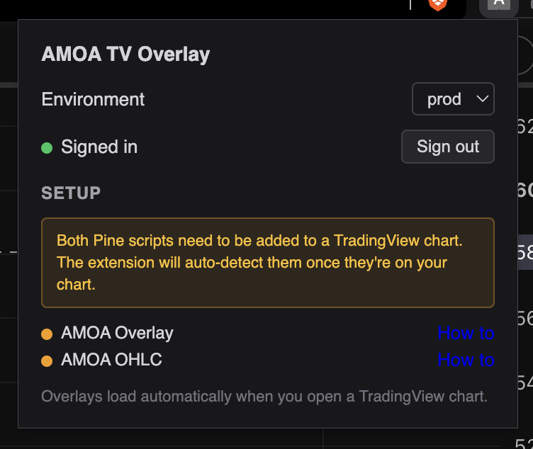

### 3. Save (`⌘S` / `Ctrl+S`)

Hit the save shortcut — or click **Save** in the toolbar.

### 4. Name it `AMOA`

TradingView opens a title dialog. Name it exactly **`AMOA`** and confirm.

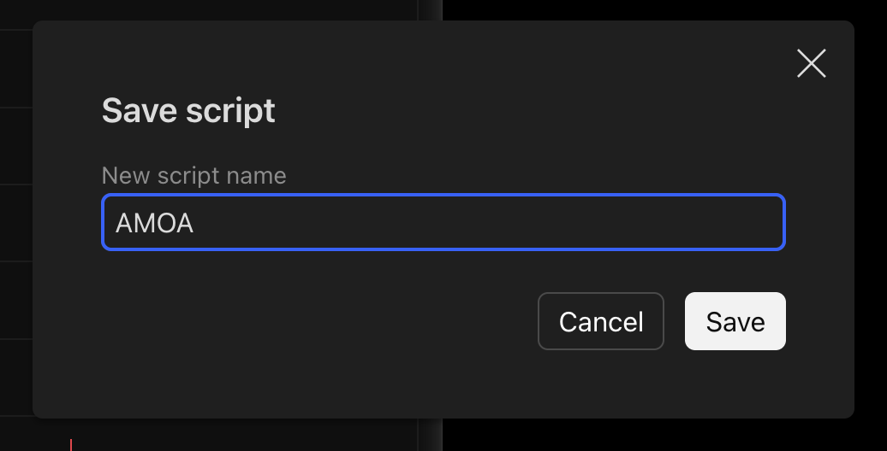

### 5. Add to chart

Click **Add to chart** in the Pine Editor toolbar.

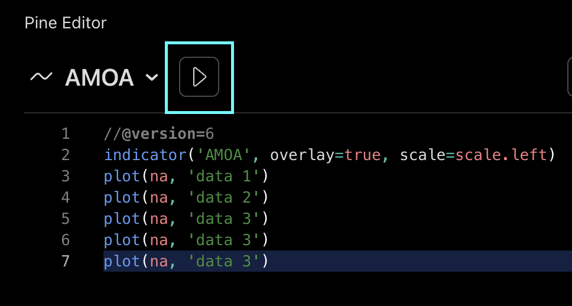

The indicator's name appears in the top-left of the chart legend — that's your confirmation it's attached. Within a second, the popup's step 1 turns green.

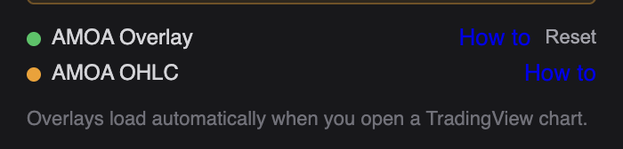

### 6. Make a copy for the second indicator

Now you'll build the OHLC script by cloning the one you just made. In the Pine Editor, click **Make a copy**.

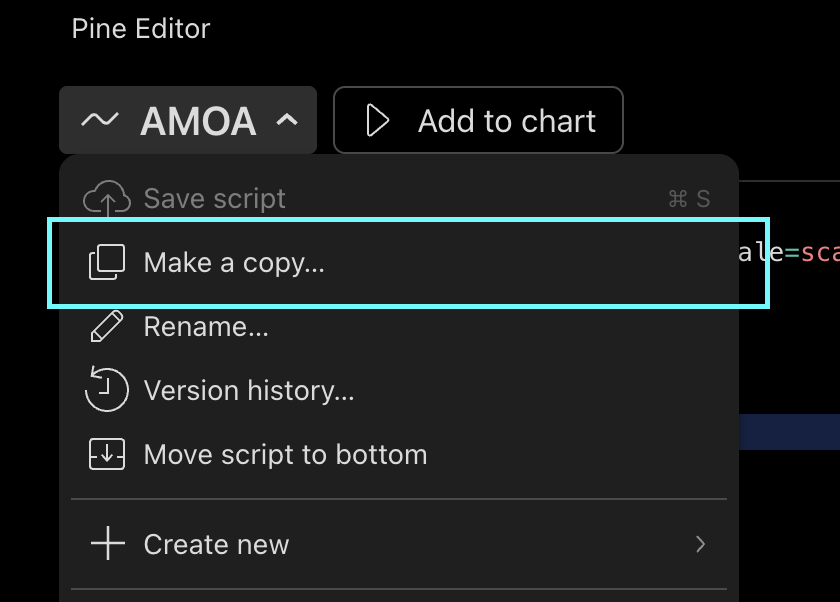

### 7. Paste the AMOA OHLC script

Replace the copied contents with:

```pine
//@version=6
indicator('AMOA OHLC', overlay=true)
plot(na, 'data 1')
plot(na, 'data 2')
plot(na, 'data 3')
plot(na, 'data 3')
plot(na, 'data 3')
```

Save it (`⌘S` / `Ctrl+S`), name it exactly **`AMOA OHLC`**, then click **Add to chart** again.

Once both indicators are on your chart the extension detects them, the Setup section collapses, and the popup shows a green **Ready** banner:

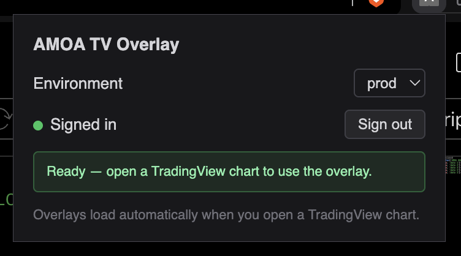

---

## Usage

The overlay panel lives at the top of every TradingView chart, next to the date-range tabs. Type in the **Add metric…** box to search — every AMOA metric your subscription tier includes autocompletes with a `?` icon that reveals a description on hover.

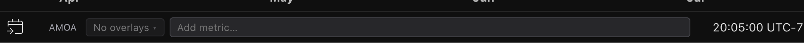

- Overlays are per-account and follow you across every chart and symbol.
- Click the count button (`3 overlays ▾`) to reveal your active list. Each row has an eye toggle (hide/show), a colored dot, the metric name (click either the eye or the name to toggle visibility), and an `×` to remove.
- Symbol changes refresh overlays for the new ticker automatically.
- Hide/show state is synced both ways with TradingView — if you hide the AMOA indicator (or a single plot inside it) via TradingView's UI, the extension's eye icons mirror that within 500 ms. Un-hiding one metric via the extension also un-hides the indicator on the chart.

---

## Building a release

```
./build.sh
```

Produces `dist/amoa-tv-v<version>.zip` with the environment selector stripped from the popup and the dev URL removed from `config.js`. Attach the zip to a new Release on the [Releases page](https://github.com/amountainofalpha/amoa-tv/releases).

---

## Support

Questions or bug reports: open an issue on this repo.
